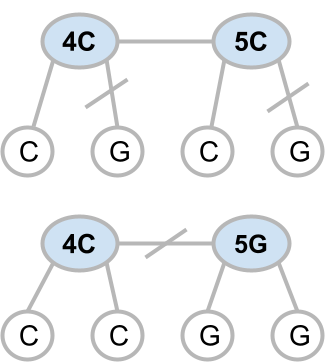
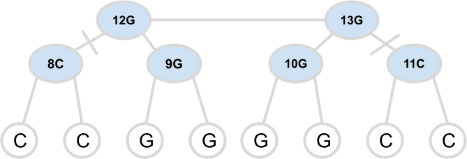

# Parsimony

Notes on solving the Large Parsimony problem with 
nearest neighbor interchange.  Here are two simple
test examples.  The first shows a tree with four leaf nodes and 
two internal nodes.  The minimal parsimony solution consists 
of swapping two leaf nodes to reduce the overall 
hamming distance.
 

{ align=left }

 
Very simple test example - solution is to swap one C with one G, 
resulting in a tree with a minimum parsimony hamming distance of 1.
 

{ align=left }

 
Another test example - this time the solution is to swap two internal
nodes, as shown below.
 

{ align=left }